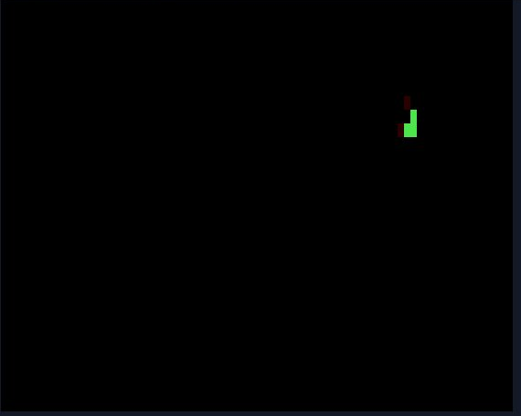
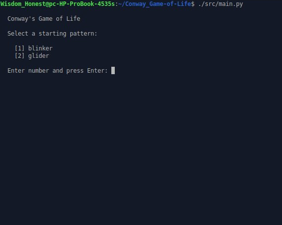
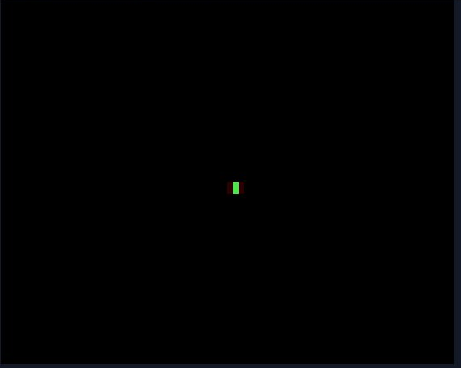

# Conway's Game of Life

A terminal-based implementation of Conway's Game of Life written in Python.
Runs entirely in the terminal with animated cell transitions — live cells
blink when born and leave a fade trail when they die.



---

## Features

- **Animated rendering** — newly born cells blink in cyan, dying cells fade in red
- **Interactive pattern menu** — select your starting pattern before the simulation begins
- **Toroidal grid** — edges wrap around, patterns never die at the boundary
- **CLI support** — skip the menu and pass arguments directly
- **Zero dependencies** — Python standard library only

---

## Quick Start

```bash
git clone https://github.com/wisdomahonest/Conway_Game-of-Life
cd Conway_Game-of-Life
chmod +x src/main.py
./src/main.py
```

**Requirements:** Python 3.6+, a terminal with ANSI color support.

---

## Usage

On launch, you will be prompted to select a starting pattern:



```
Conway's Game of Life

Select a starting pattern:

  [1] blinker
  [2] glider

Enter number and press Enter:
```

You can also pass arguments directly to skip the menu:

```bash
# run the glider
./src/main.py --pattern glider

# run the blinker on a larger grid at a slower speed
./src/main.py --pattern blinker --rows 40 --cols 120 --delay 0.2
```

| Argument | Default | Description |
|----------|---------|-------------|
| `--pattern` | prompts | Starting pattern: `glider` or `blinker` |
| `--rows` | `30` | Grid height in cells |
| `--cols` | `80` | Grid width in cells |
| `--delay` | `0.12` | Seconds between generations |

Press `q` or `Q` to quit at any time. `Ctrl-C` also exits cleanly.

---

## Patterns

### Glider
A 5-cell spaceship that moves diagonally across the grid indefinitely.
The most iconic pattern in Conway's Game of Life.


### Blinker
A 3-cell oscillator that alternates between horizontal and vertical
every generation. Period-2.



---

## How It Works

### The Rules

Each cell is either **alive** or **dead**. Every generation, four rules
are applied simultaneously to every cell:

| Condition | Outcome |
|-----------|---------|
| Live cell, fewer than 2 live neighbors | Dies — underpopulation |
| Live cell, 2 or 3 live neighbors | Survives |
| Live cell, more than 3 live neighbors | Dies — overpopulation |
| Dead cell, exactly 3 live neighbors | Becomes alive — reproduction |

### Cell Animation

The renderer tracks state transitions between generations and animates them:

| Transition | Glyph | Color | Effect |
|------------|-------|-------|--------|
| Dead → alive | `▓` | Cyan | Blinks for 3 frames |
| Alive → dead | `░` | Red | Fades for 1 frame |
| Alive → alive | `█` | Green | Static |
| Dead → dead | ` ` | — | Invisible |

### Architecture

```
src/
├── main.py       — entry point, CLI args, pattern menu, simulation loop
├── grid.py       — Grid class: board state, Conway rules, double-buffer
├── renderer.py   — Renderer class: curses display, cell animation
└── patterns.py   — seed pattern definitions and stamp utility
```

Each module has a single responsibility. `grid.py` and `renderer.py`
have no knowledge of each other — `main.py` is the only coordinator.

---

## Project Structure

```
Conway_Game-of-Life
├── README.md
├── src/
│   ├── main.py
│   ├── grid.py
│   ├── renderer.py
│   └── patterns.py
├── docs/
│   └── algorithm.md
└── demo/
    ├── option.png
    ├── blinker.png
    └── glider.png
```

---

## License

MIT © Wisdom A. Honest